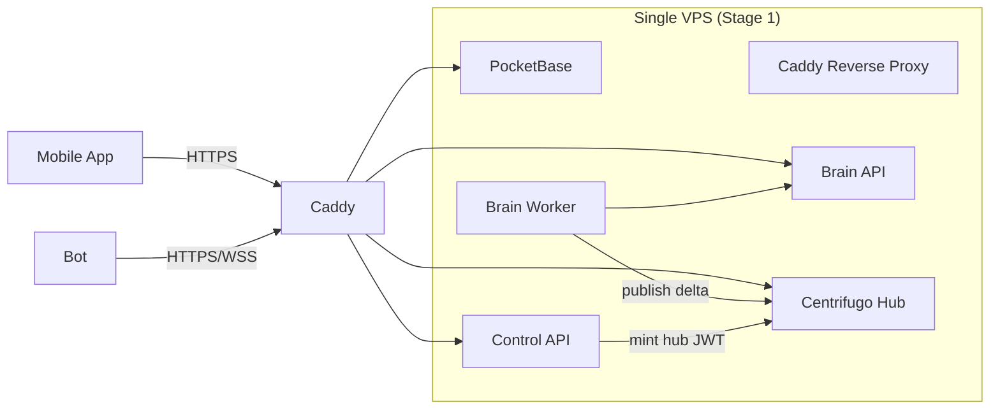
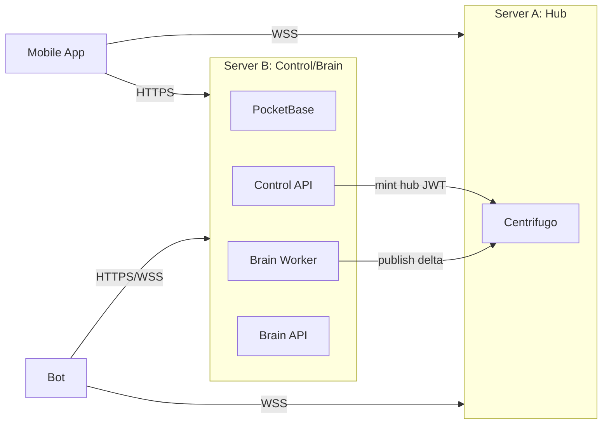

# TheCouncilAI — Teknik Sistem Mimarisi (Tek Dosya)

> **Amaç:** Tek kişi tarafından kolayca kurulup yönetilebilen, açık kaynak, düşük maliyetli, güvenli (App↔Bot E2EE), ölçeklenebilir bir “Analiz Üretimi + Dağıtımı + Bot Entegrasyonu” sistemi.

---

## 1) Tasarım İlkeleri

- **Tek operatör / düşük operasyon:** Az sayıda servis, net sorumluluk ayrımı, otomatik TLS, basit deploy.
- **Tek domain / tek giriş noktası:** `api.thecouncilai.com` altında path bazlı reverse proxy ile tüm servisler.
- **Veri düzlemi / kontrol düzlemi ayrımı:**
  - **Hub (Data Plane):** Gerçek zamanlı dağıtım/router (WebSocket).
  - **Control/Brain (Control Plane):** Auth + abonelik + analiz üretimi + snapshot API.
- **E2EE sadece App ↔ Bot:** Hassas veriler (API key, bakiye, işlem geçmişi) admin tarafından okunamaz.
- **Snapshot + Delta modeli:** Uygulama açılışında toplu durum; sonrasında sadece değişenler.
- **Kademeli ölçek:** Tek sunucu ile başla → hub’ı ayrı sunucuya taşı → Redis engine ile çoklu hub node.

---

## 2) Bileşenler (Servisler)

### 2.1 Reverse Proxy + TLS
- **Caddy** (önerilen)
  - Otomatik HTTPS (Let’s Encrypt)
  - Path bazlı reverse proxy
  - Tek domain altında servisleri ayırma

### 2.2 Hub (Realtime Router)
- **Centrifugo**
  - App/Bot için WebSocket bağlantısı ve channel pub/sub
  - JWT ile bağlantı ve kanal yetkilendirmesi
  - Başlangıçta **memory engine** (tek node, en az bakım)
  - Büyüyünce **Redis engine** (çok node, HA, yüksek bağlantı)

### 2.3 Control Plane
- **PocketBase**
  - Kullanıcı yönetimi (email/şifre)
  - Abonelik durumu kaydı (Paddle webhook ile)
  - Admin paneli
- **Control API (custom, küçük servis)**
  - PocketBase doğrulaması
  - Abonelik kontrolü
  - Centrifugo connection token (JWT) üretimi

### 2.4 Brain
- **Brain Worker**
  - Ücretsiz/3. parti piyasa verisini çekip analiz üretir
  - Öğrenme verisini saklar (kapanan pozisyon sonrası training dataset)
  - Dışa “compact analiz” üretir
- **Brain API**
  - `/snapshot` (1000 hisse güncel analiz listesi)
  - `/health` (durum/telemetri)

### 2.5 İstemciler
- **Mobil Uygulama**
  - Login (PocketBase)
  - Snapshot çekme (Brain API)
  - Delta dinleme (Centrifugo)
  - Bot ile E2EE mesajlaşma (Centrifugo üzerinden route)
- **Bot (müşteri sunucusunda)**
  - Borsa API bağlantısı (API key botta şifreli tutulur)
  - Brain’den analiz alır (Hub bağımsız çalışabilmesi için)
  - App ile E2EE üzerinden komut/yanıt alışverişi

---

## 3) Yüksek Seviye Mimari

### 3.1 Tek Sunucu (Başlangıç - Önerilen)
Aynı makinede container’lar; sorumluluklar ayrık, taşımak kolay.



### 3.2 İki Sunucu (Stage 2 - Kolay Taşıma)
Hub ayrı makineye taşınır; Control/Brain aynı kalır.



---

## 4) Domain & Path Yapısı (`api.thecouncilai.com`)

**Tek domain**, Caddy ile path bazlı yönlendirme:

- **Brain API**
  - `GET /snapshot`
  - `GET /health`
- **Centrifugo**
  - `WSS /connection/websocket`
  - `POST /api` (server publish)
- **PocketBase**
  - `/*` altında karışmasın diye: ` /pb/* ` (prefix)
  - Dışarıdan: `https://api.thecouncilai.com/pb`
- **Control API (önerilen)**
  - `GET /control/hub-token`
  - `GET /control/subscription` (opsiyonel debug)

> Not: PocketBase “/api” path’ini kendi içinde kullandığından, dışarıdan `/pb/api/...` olarak görünmesi çakışmayı önler.

---

## 5) Veri Modeli & Gizlilik

### 5.1 Kalıcı Veri (Server tarafı)
**PocketBase**
- `users` (auth collection): email, password hash
- `subscriptions` / user alanları: abonelik aktif mi, plan, dönem, vb.
- `user_hub_assignment` (opsiyonel): multi-hub / shard durumunda kullanıcı hangi hub’ta

**Brain**
- Öğrenme veri seti (pozisyon kapanınca training için)
- Operasyonel loglar

### 5.2 Kalıcı Olmayan Veri
- Realtime delta mesajları (hub üzerinden akar; kalıcı tutmak şart değil)
- Snapshot her açılışta yeniden üretilir

### 5.3 Hassas Veriler (Admin görünmesin)
- Borsa API key’leri: **server’da saklanmaz**
- Bot kendi ortamında **şifreli** saklar
- App ↔ Bot mesajları **E2EE** (hub route eder ama okuyamaz)

---

## 6) Mesaj Formatları (Analiz)

> Sistem “fiyat/sinyal” değil, **analiz** üretir. App/Bot yalnızca **yön + kalite** görür.

### 6.1 Compact Analiz Değeri
- `v`: `-100..+100` (int)
  - `v > 0` → **BUY eğilimi** (yeşil / yukarı ok)
  - `v < 0` → **SELL eğilimi** (kırmızı / aşağı ok)
  - `v = 0` → **HOLD** (nötr)
- `abs(v)` → kalite/kuvvet (örn 85 = 0.85)

### 6.2 Snapshot (App açılış)
**HTTP**: `GET /snapshot`

```json
{
  "e": 12891,
  "t": 1735790400000,
  "m": [
    ["AAPL", 85],
    ["MSFT", -40],
    ["TSLA", 0]
  ]
}
```

- `e`: epoch/version
- `t`: timestamp (ms)
- `m`: matrix (symbol, value)

### 6.3 Delta (Realtime)
**Centrifugo channel**: `signals:delta`

```json
{
  "e": 12892,
  "t": 1735790405000,
  "d": [
    ["AAPL", 90],
    ["NVDA", 55]
  ]
}
```

- `d`: sadece değişenler

### 6.4 Tutarlılık Kuralı (Önemli)
- App snapshot ile `e` alır
- Delta `e` sıralı gelmeli
- Eğer `e` atladıysa (kopma): **app tekrar `/snapshot` çeker**

---

## 7) Akışlar (Uçtan Uca)

### 7.1 Kayıt / Login
1. App → PocketBase: login/register
2. App token alır (PocketBase auth token)
3. App → Control API: `/control/hub-token`
4. Control API:
   - PocketBase token doğrular
   - Abonelik aktif mi kontrol eder
   - Centrifugo için **kısa ömür connection JWT** üretir (TTL 1 saat)

### 7.2 App Başlangıç (Snapshot + Delta)
1. App → Brain API: `GET /snapshot`
2. App state’i `m` ile doldurur
3. App → Hub: WSS bağlanır (JWT ile)
4. App `signals:delta` subscribe olur
5. Delta geldikçe sadece değişen semboller güncellenir
6. Epoch atladıysa yeniden `/snapshot`

### 7.3 Bot Çalışma (Hub bağımsız)
1. Bot → Brain: “bot stream” veya periyodik pull (5–10 sn)
2. Bot analizleri alır, kendi risk profiline göre uygular
3. Gerekirse borsaya emir yollar

> Bu sayede Hub arızasında bile bot çalışmaya devam eder.

### 7.4 App ↔ Bot E2EE (Hassas Veri)
- Kanal: `e2ee:{userId}:{botId}`
- Payload: şifreli envelope (AES-GCM/ChaCha20-Poly1305 gibi AEAD)

**Örnek mesaj tipleri**
- App → Bot: `GET_ACCOUNT_SNAPSHOT`
- Bot → App: `ACCOUNT_SNAPSHOT` (bakiye/pozisyon/emir)
- App → Bot: `PLACE_ORDER` / `CANCEL_ORDER`
- Bot → App: `ORDER_STATUS_UPDATE`

**Pairing (MITM önleme, önerilen)**
- Bot publicKey + botId QR
- App QR okur, shared secret türetilir
- Bundan sonra tüm bot/app payload E2EE

---

## 8) Servis Gereksinimleri (Stage 1)

> Aşağıdaki değerler “rahat başlangıç” içindir. Trafik arttıkça hub’ı ölçeklersiniz.

### 8.1 Donanım (Tek VPS)
- **CPU:** 8 vCPU (4 vCPU ile de başlayabilir)
- **RAM:** 16 GB (8 GB minimum)
- **Disk:** 80–160 GB NVMe
- **Network:** 1 Gbps tercih (en az 250–500 Mbps)

### 8.2 Sistem Ayarları
- **ulimit (open files):** WebSocket bağlantıları için yükseltilmeli
  - örn: `nofile 100000`
- Swap (opsiyonel): düşük, RAM baskısında stabilite

### 8.3 Container/Servis Bazlı Tahmini Kaynak
- Centrifugo: bağlantı sayısına bağlı (RAM + FD), CPU genelde düşük
- Brain Worker: market data + analiz hesaplarına bağlı (CPU)
- PocketBase: hafif (DB küçük)
- Caddy: çok hafif

---

## 9) Güvenlik

### 9.1 Transport
- Tüm trafik: **HTTPS/WSS (443)**
- 80 → 443 redirect (Let’s Encrypt için normal)

### 9.2 Secrets
- `CENTRIFUGO_API_KEY`: Brain→Hub publish
- `CENTRIFUGO_TOKEN_HMAC_SECRET`: Hub client JWT doğrulaması
- PocketBase admin credentials
- Paddle webhook secret / signature doğrulama anahtarı

> Secrets git’te tutulmaz. `.env` / secret manager / deploy paneli üzerinden yönetilir.

### 9.3 Yetkilendirme
- Hub JWT kısa ömürlü (1 saat)
- JWT içinde izinli kanallar (ör. sadece `signals:*`, kendi `e2ee:*`)
- Abonelik iptal olursa token yenilenemez → erişim kesilir

### 9.4 Gizlilik
- Admin, botun borsa API key’ini ve kullanıcı hesap verisini göremez (E2EE + bot lokal saklama)

---

## 10) Ölçekleme Planı

### Stage 1: Tek Sunucu
- Centrifugo memory engine
- Her şey tek makinede

### Stage 2: Hub Ayrı Sunucu
- Hub ayrı VPS (bağımsız deploy)
- Control/Brain aynı kalır

### Stage 3: Multi-Hub (Redis Engine)
- Centrifugo Redis engine
- 2–N hub node + load balancer
- Realtime fanout kapasitesi artar
- HA sağlanır

### Stage 4: Brain Ayrıştırma (opsiyonel)
- Brain worker ayrı compute node
- Snapshot API ayrı stateless servis
- Cache/CDN eklenebilir

---

## 11) Operasyon, İzleme, Yedekleme

### İzleme
- `/health` (Brain API)
- Centrifugo metrics/health (opsiyonel)
- Uygulama telemetry (opsiyonel)

### Loglama
- Container logları (json)
- Brain karar logları (debug/learning)

### Backup
- PocketBase data klasörü günlük yedek
- Brain learning dataset yedek (periyodik)

---

## 12) Minimum Kurulum Özeti (Stage 1)

1. DNS: `api.thecouncilai.com` → VPS IP
2. Caddy: path bazlı reverse proxy
3. PocketBase: `/pb` altında
4. Brain API: `/snapshot`, `/health`
5. Centrifugo: `/connection/websocket`, `/api`
6. Control API: `/control/hub-token`
7. Mobil App config: tek base url `https://api.thecouncilai.com`

---

## 13) Ek: Önerilen Kanal İsimleri

- Global delta: `signals:delta`
- (Opsiyonel) Global snapshot channel: `signals:snapshot` (biz HTTP kullandık)
- E2EE: `e2ee:{userId}:{botId}`
- (Opsiyonel) Bot status: `bot:{botId}:status`

---

## 14) Ek: Risk Profili (Client-side Filter)

App/Bot tarafında:
- konservatif: `abs(v) >= 70`
- orta: `abs(v) >= 40`
- agresif: `abs(v) >= 20`

Bu sayede paket büyümeden kullanıcı kişiselleştirmesi sağlanır.

---

**Bu doküman, proje sunumu için tek dosya “mimari + akış + gereksinim” referansı olarak kullanılabilir.**
